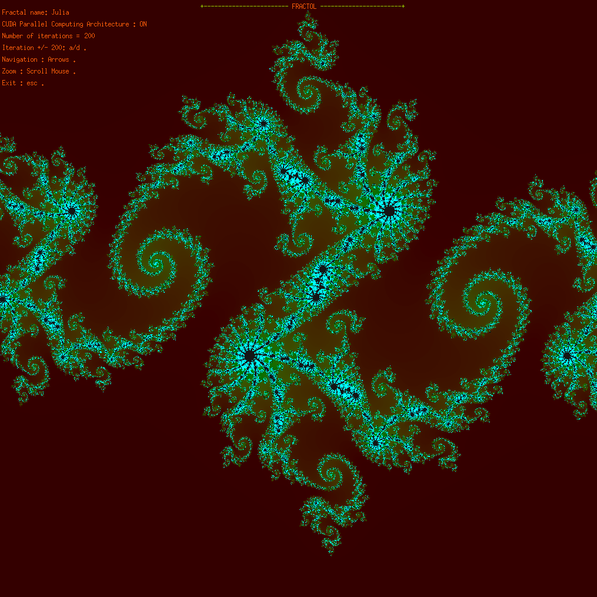
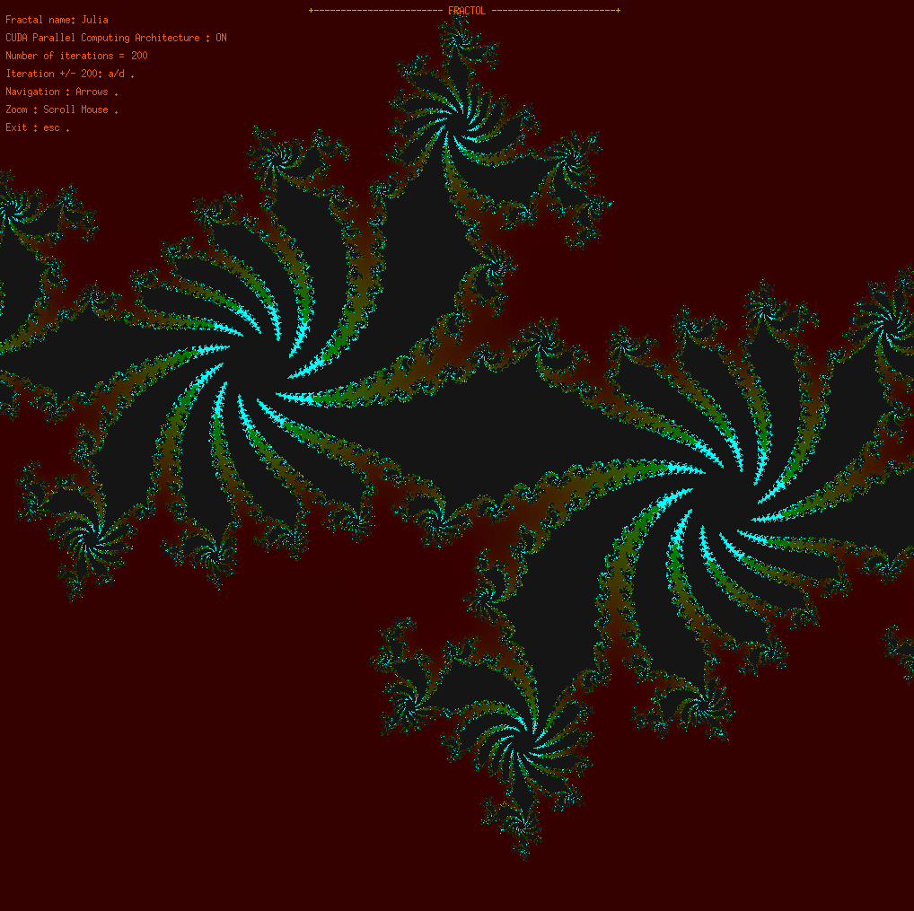
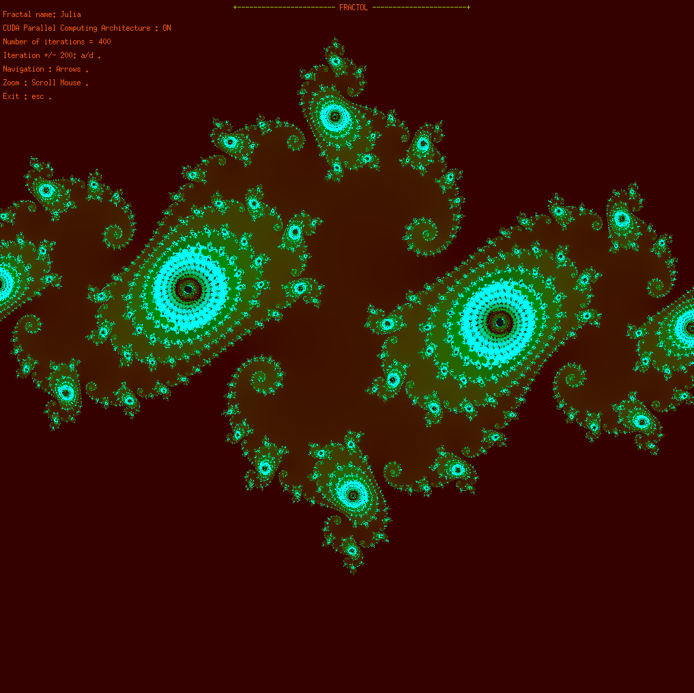
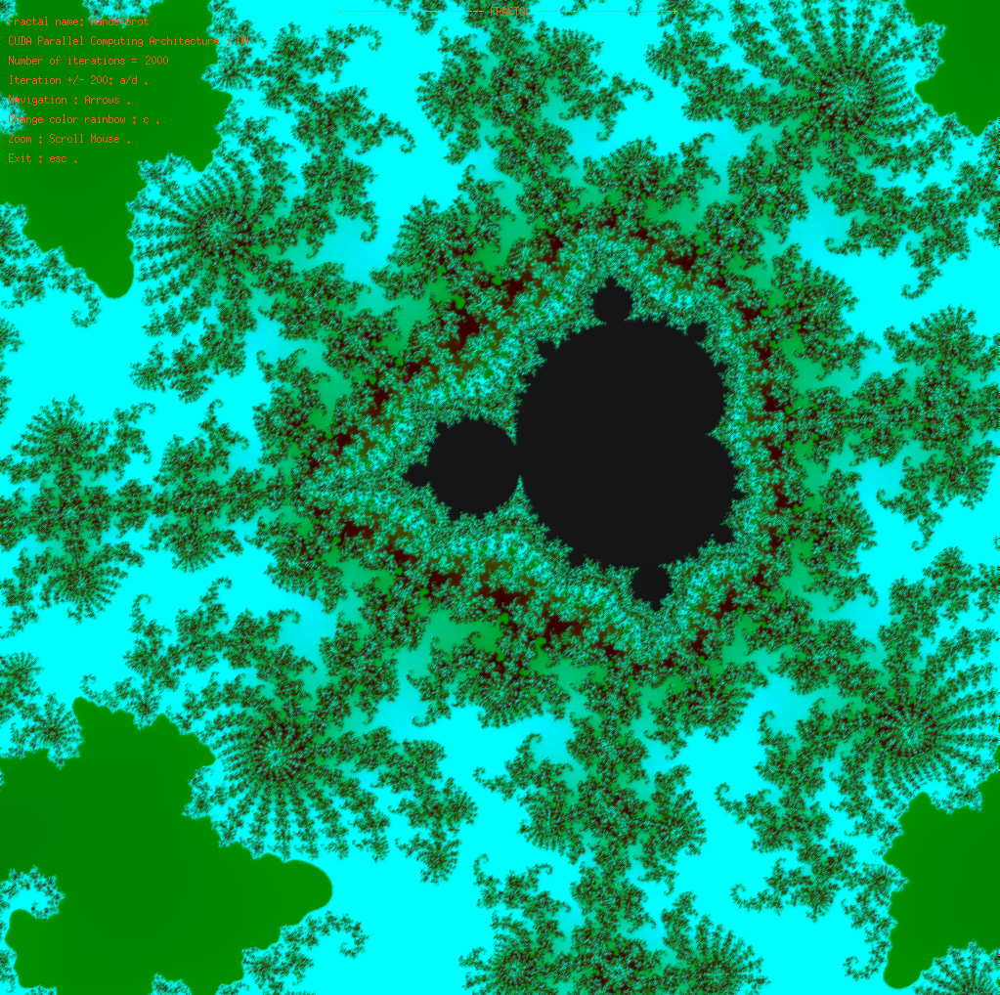

fract'ol
=========

- usage: ./fractol [-cpu / -gpu]	[Fractal Name ...]
	* -cpu = Use cpu computing.
	* -gpu = Use CUDA Parallel Computing Architecture.
- fractals supported: mandelbrot, julia, newton

